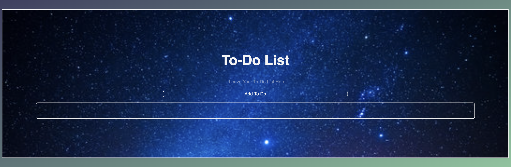

# 📝 To-Do List App

## 📌 Overview

A simple, interactive **To-Do List web application** built with HTML, CSS, and JavaScript.

Users can **add tasks, mark them complete, and remove them**, showcasing DOM manipulation and event handling in JavaScript.

---

## 🛠 Problems Solved / Why This Matters

This project addresses **common productivity challenges**:

- 📋 **Task management made simple** – organize daily tasks in a clean, intuitive interface.  
- ⏱ **Improves focus and efficiency** – quickly add, complete, and remove tasks without navigating complex software.  
- 💻 **Practical coding skills** – demonstrates mastery of **DOM manipulation, event handling, and JavaScript classes**, essential for front-end development.  
- 🔄 **Persistence with local storage** – keeps tasks saved between sessions, showing practical use of front-end storage techniques.  

---

## 🚀 Features

- ✅ Add new to-do items  
- ✏️ Mark tasks as completed by clicking  
- ❌ Remove tasks with a double-click  
- 🎯 Clean and user-friendly interface  
- 💾 Persist tasks in **local storage** (tasks remain after refreshing the browser)

---

## 📂 Technologies Used

- **HTML5**  
- **CSS3**  
- **JavaScript (ES6+)**

---

## 📦 How to Use

1. Open the **live demo** link below.  

     **Live Demo:** [https://sarahborgelt.github.io/ToDoList/](https://sarahborgelt.github.io/ToDoList/)  
     **Source Code:** [GitHub Repository](https://github.com/SarahBorgelt/ToDoList)

2. Type a task into the input box.  
3. Click **"Add To Do"** or press `Enter` to add it to the list.  
4. Click a task to mark it as complete.  
5. Double-click a task to remove it.  

---

## 🧠 Lessons Learned

This project helped me practice:  

- JavaScript classes and object-oriented design  
- DOM manipulation  
- Event listeners (`click`, `dblclick`, `keypress`)  
- Building interactive and responsive UI components  
- Using browser storage for data persistence